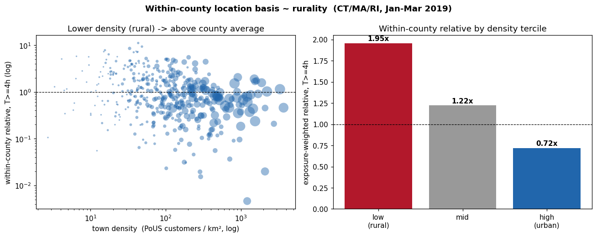
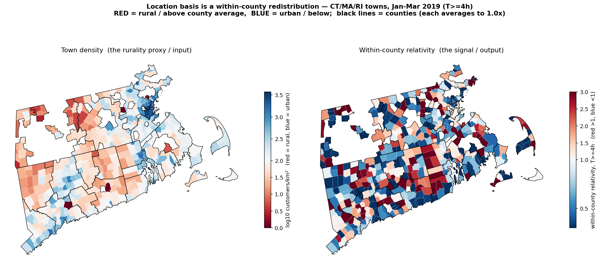

# 01 · Findings — town land area & density (Census Gazetteer)

*Onboarding + first analysis of the Census 2023 Gazetteer (county subdivisions)
as a location-basis feature source, and the Step-2b test: does real **density**
beat the in-hand **size** proxy? Follows the notebook principles — interpret
every variable, pin + cache, no silent drops, every output a takeaway. (The
gazetteer is a tidy table = the "load and profile" case; the NLCD raster, next,
gets the full from-scratch notebook treatment.)*

Date: 2026-06-17. Scripts: `../analysis/lib/census_gazetteer.py`,
`../analysis/town_density_vs_size.py`. Target predicted: the mean-1 within-county
relative from [`../../poweroutage_us/docs/06_findings.md`](../../poweroutage_us/docs/06_findings.md)
sets 6–7.

> **New here?** Read [`00_concepts.md`](00_concepts.md) first. One line: a town's
> **relativity** is how often its customers hit the outage threshold vs the average
> customer *in the same county* — 1.0 = county average, 2.0 = twice as often, 0.5 =
> half. It is mean-1 within each county (rural towns > 1, urban < 1, netting to the
> county rate).

## Source & provenance

US Census **2023 Gazetteer**, county-subdivision files, per state:
`.../2023_Gazetteer/2023_gaz_cousubs_<SS>.txt` (SS = state FIPS). Tab-separated,
latin-1, **no API key**. Raw bytes cached under `data/raw/census_gazetteer/`. 571
towns across CT (09) / MA (25) / RI (44).

## Field dictionary (complete pass)

| Column | Meaning | Use-decision |
|---|---|---|
| `GEOID` | 10-digit state+county+cousub FIPS | carried as id; county part **not** used for join (gotcha below) |
| `NAME` | town/MCD name, e.g. "Bethany town" | **join key**, normalized (strip " town"/" city") |
| `ALAND` | land area, m² (**excludes water**) | **used** → density denominator (→ km²) |
| `INTPTLAT`, `INTPTLONG` | internal point (centroid) lat/lon | carried (point ops + canopy sampling later) |
| `AWATER`, `ALAND_SQMI`, `AWATER_SQMI` | water area; areas in sq-mi | ignored (redundant with ALAND) |
| `USPS`, `ANSICODE`, `FUNCSTAT` | state abbr; ANSI id; functional status | ignored (USPS used only as the state tag) |

## Join audit (no silent drops)

**445 / 459** PoUS towns matched a gazetteer land area (**96.9%**). The 14
unmatched are large MA municipalities with the quirky legal form "X Town city"
(Barnstable, Weymouth, Methuen, Watertown, Winthrop, …) that the suffix-stripper
misses — all urban/large, so they sit *below* their county average and their
absence does not affect the rural-tail finding. (9 within-state name collisions
in the gazetteer, deduped first-wins.) Fixing the MA "Town city" forms is a
tracked to-do, not a blocker.

## Result — density beats size; rurality is real

| T | median ρ(size, rel) | median ρ(**density**, rel) | rel low-dens (rural) 3rd | rel high-dens (urban) 3rd |
|---|---|---|---|---|
| 1h | −0.35 | **−0.41** | 1.75 | 0.80 |
| 4h | −0.19 | **−0.35** | 1.90 | 0.75 |
| 8h | −0.20 | **−0.30** | 2.11 | 0.70 |

- **Density is the stronger predictor at every T** — the within-county rank
  correlation roughly *doubles* at T≥4h (−0.19 → −0.35). Area-normalizing size
  into a real density disentangles "big town" from "spread-out town."
- The **tercile gradient is clean and monotone**: rural third ≈ 1.9–2.0× its
  county average, mid ≈ 1.2× (figure), urban third ≈ 0.7×, widening with duration
  (rural ~3× urban at T≥8h).
- The size tercile gap is *similar* in magnitude, so the in-hand size proxy is a
  usable fallback — but density is the better feature and the land-area join is
  cheap, so it earns its place.

**Takeaway:** the within-county location-basis signal is **rurality**, and density
is its best simple proxy so far — the seed of a mean-1 frequency relativity (rural
uplift, urban discount).

### The same signal on a map

Choropleth on real town boundaries (script: `../analysis/map_relativity.py`,
boundaries via `../analysis/lib/town_boundaries.py`; 445/445 towns joined):

Town **density** (left) and the **within-county relativity** (right: red = rural
> 1, blue = urban < 1; black = county boundaries). The geography matches the
numbers — rural towns run hot, urban cores run cool, and each county balances to
1.0×.

## Follow-up — does tree canopy add beyond density? No (build on density alone)

Onboarded NLCD **Tree Canopy Cover** (CONUS 2021) via MRLC WMS point-sampling —
full executed notebook (with figures + an HTML copy for sharing):
[`../analysis/notebooks/02_nlcd_canopy.ipynb`](../analysis/notebooks/02_nlcd_canopy.ipynb).
Centroid canopy obtained for 441/445 towns. Within-county medians:

| | density | canopy | partial(canopy \| density) |
|---|---|---|---|
| within-county \|ρ\| with relative | **0.30–0.41** | 0.02–0.12 | **≈ 0** (slightly −ve at T≥4h) |

Canopy and density are only loosely inverse (ρ ≈ −0.24), and **once density is
controlled for, canopy adds essentially nothing**. Reason: NE canopy *saturates*
(median 68%), so it cannot separate rural from urban *within a county* — density
does.

**Decision:** build the within-county modifier on **density alone** for NE Gen-1.
Canopy is parked, not deleted — revisit via a zonal mean and in non-NE regions
(e.g. TX/West), where canopy may discriminate and land-cover/wind/terrain may
matter more. Region-specific: do **not** generalize "density alone" nationally yet.

## The deployable modifier — within-county density relativity

Turned the signal into the actual modifier: a within-county density **relativity**
(mean-1, monotone, capped). Full executed notebook:
[`../analysis/notebooks/03_density_relativity.ipynb`](../analysis/notebooks/03_density_relativity.ipynb)
(+ `.html`); deployable artifact `../analysis/outputs/density_relativity.json`.

| density tercile (within county) | empirical (T≥4h) | v0 shadow (capped 0.8–1.4) |
|---|---|---|
| rural (sparsest third) | 1.90× | 1.40× |
| mid | 1.23× | 1.23× |
| urban (densest third) | 0.71× | 0.80× |

Monotone, **widens with T** (rural 1.76 → 2.06 from T=1 → 8h), and **conserves**
(per-county exposure-weighted mean ~0.98 median). **Runtime needs Census density
only** — PoUS is calibration. Status: **shadow**; validate out-of-region (e.g. TX)
before activation; EIA-861 / utility corroboration belongs to the grid lane, not
this within-county relativity.

## Follow-up — tried NLCD impervious to fix the commercial-core flaw; kept density (2026-06-18)

Population density mis-ranks **commercial / low-residential urban cores**: Midtown
Manhattan read p13 ("rural") within its county — few residents, but the most
urban, most-undergrounded grid there is — so it wrongly got an uplift. Tested NLCD
2021 impervious surface (MRLC WMS point-sample) as a fix. Script:
`../analysis/impervious_experiment.py`.

- **At a true point, impervious is correct:** ESB **94%**, rural Litchfield **3%**
  — it fixes the direction pop density gets wrong.
- **But as a town/within-county proxy it is worse:** within-county
  ρ(impervious, rel) = **−0.20** vs ρ(density, rel) = **−0.35** (24 pilot
  counties, T≥4h). Town-**centroid** impervious is noisy and zero-heavy
  (median **0%** — a centroid often lands in undeveloped land; one 30 m pixel
  hits a road = 94% or a lawn = 0%). corr(impervious, log density) = +0.54.

**Conclusion — keep `density` for v1.** It is validated and beats point-impervious.
The commercial-core mis-ranking is a **localized, shadow-only** flaw of the
*national pop-density extrapolation* — it does **not** touch the validated pilot.
The proper fix is a **zonal-mean impervious / developed-land-cover per tract**
(raster zonal-stats — heavier; download NLCD raster + rasterio), parked as a
refinement. This — together with the canopy result above — is *why we keep it
simple with density*.

## Gotchas

- **CT county redefinition** — the 2023 gazetteer files CT towns under the new
  planning regions (GEOID county part `110`...), not the legacy counties. We join
  on `(state, town name)`, never the gazetteer county FIPS. The EAGLE-I raw
  outage source appears to switch to planning-region FIPS around 2025-05-29; see
  the [CT FIPS transition bridge](../../poweroutage_us/docs/10_connecticut_fips_transition_bridge.md).
- **`ALAND` includes uninhabited land** (forest) → density reads heavily-forested
  towns as low-density. That is the *right direction* for rurality, but it
  conflates "few people" with "much uninhabitable land"; canopy (next) helps
  separate the two.
- **One region, one quiet season** (CT/MA/RI Jan–Mar 2019, one nor'easter) — all
  findings provisional until replicated (e.g. TX, a storm season).
- **Cell exposure, not premise** — inherited ceiling; the town→address last mile
  still needs live geometry / meter data.

## Carried-forward artifact + open question

`../analysis/outputs/town_density_features.csv` — per town: tracked, land area,
density, centroid (lat/lon), and the within-county relative. Ready to (a) seed
the relativity and (b) attach the next feature.

**Open question for the next step:** does **NLCD tree canopy** add lift *beyond*
density? Canopy is the physical mechanism (tree contact); density is a proxy for
it — if canopy doesn't beat density, density is the parsimonious answer. NLCD is
a 30 m raster (a complex source) → it gets the full onboarding-notebook treatment.

## Cross-references

- Target build + size attribution: [`../../poweroutage_us/docs/06_findings.md`](../../poweroutage_us/docs/06_findings.md) sets 6–7.
- Research plan + target definition: [`../../../plan/location_basis_research_plan.md`](../../../plan/04_location_basis/location_basis_research_plan.md).
- Spatial entity resolution (town↔county↔utility): [`../../poweroutage_us/docs/09_spatial_entity_resolution.md`](../../poweroutage_us/docs/09_spatial_entity_resolution.md).
