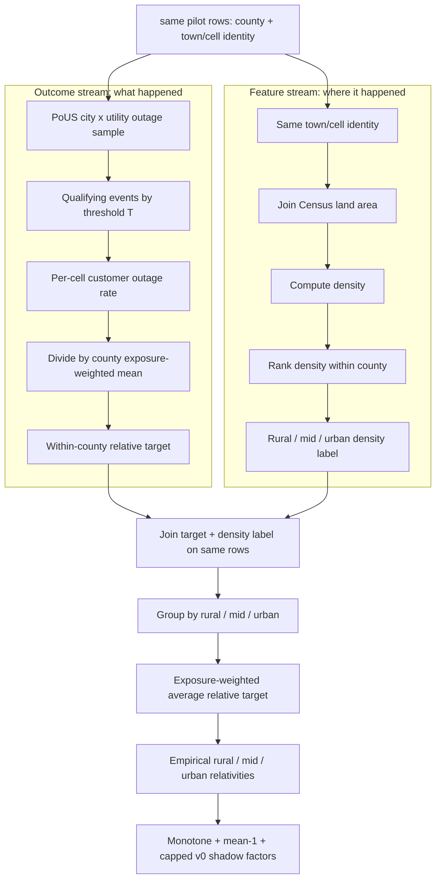

# Derivation of Location Relativity Factors

- **Status:** audit appendix for the location-basis shadow layer; not active pricing.
- **First written:** 2026-06-18
- **Last reviewed:** 2026-06-18
- **Read alongside:** [Location Basis Methodology](location_basis_methodology.md), [Per-Customer Pricing Fundamentals](fundamentals/per_customer_pricing_fundamentals.md), and the location feature workstream [`docs/extra/location_features/`](../extra/location_features/).

## Why this appendix exists

The location-basis methodology uses rural / mid / urban **relativity factors**.
This appendix answers the audit questions:

- Why is the adjustment a multiplier?
- What data produced the factors?
- Did we fit a continuous function or derive bucket ratios?
- Which files reproduce the numbers?
- What validation supports the direction and magnitude?

The short answer: the factors are **within-county frequency relativities**. They
redistribute the per-customer county price across locations inside the same
county, while preserving the county average at roughly 1.0.

## 1. System Flow at a High Level

There are two related flows: the **calibration flow** that learns the factors,
and the **runtime quote flow** that applies them.

### Calibration flow: how the factors were learned

```text
Calibration is not one straight line. It is two streams, joined on the
same county / town / cell rows.

                                      same pilot rows
                              county + town/cell identity
                                             |
                 +---------------------------+---------------------------+
                 |                                                       |
                 v                                                       v
      OUTCOME STREAM: what happened                       FEATURE STREAM: where it happened
      --------------------------------                     ---------------------------------
      PoUS city x utility outage sample                    same town/cell identity
                 |                                                       |
                 v                                                       v
      qualifying events by threshold T                     join Census land area
                 |                                                       |
                 v                                                       v
      per-cell customer outage rate                        compute density
      (customer-share summed over events)                  (pilot: tracked customers / land area)
                 |                                                       |
                 v                                                       v
      divide by county exposure-weighted mean              rank density within each county
                 |                                                       |
                 v                                                       v
      WITHIN-COUNTY RELATIVE TARGET                        RURAL / MID / URBAN DENSITY LABEL
      "how high vs own county average?"                    "where does this row sit in county?"
                 |                                                       |
                 +---------------------------+---------------------------+
                                             |
                                             v
                         join target + density label on the same rows
                                             |
                                             v
                         group rows by rural / mid / urban label
                                             |
                                             v
                         exposure-weighted average relative target
                                             |
                                             v
                         empirical rural / mid / urban relativities
                                             |
                                             v
                         monotone + mean-1 + capped v0 shadow factors
```

Mermaid version for the same logic:



The pilot outcome data is PowerOutage.US (PoUS), CT / MA / RI, Jan-Mar 2019.
PoUS is **calibration-only**. It is not needed at quote time.

### Runtime quote flow: how a location receives a price

```text
address or "lat, lon"
        |
        v
point (lon, lat)
        |
        +--> county FIPS --> per-customer county price
        |
        +--> Census tract --> density = population / land area
                              |
                              v
                         rank inside county
                              |
                              v
                         rural / mid / urban
                              |
                              v
                         relativity factor
        |
        v
location price = per-customer county price x location relativity
```

The runtime feature is Census density. The pilot uses town density because PoUS
is town/city-grained; the national dashboard uses tract density because Census
tracts provide national address-scale coverage.

## 2. Worked Example: How the Two Streams Connect

The easiest way to understand the method is to keep two streams separate until
the last step:

1. **Observed outage stream:** PoUS tells us which towns/cells ran above or below
   their county average.
2. **Location feature stream:** Census/rurality tells us whether those same
   towns/cells are rural, mid, or urban inside their own county.

Then we join those two streams and ask: when a town is rural inside its county,
how high is its observed relative outage target on average?

### Stream 1: observed outage target from PoUS

Suppose the PoUS pilot gives us three counties, each with three town/cell rows,
at threshold `T=4h`.

| county | town | tracked customers | observed outage rate |
|---|---|---:|---:|
| A | A1 | 10,000 | 0.60 |
| A | A2 | 20,000 | 0.30 |
| A | A3 | 30,000 | 0.15 |
| B | B1 | 10,000 | 0.50 |
| B | B2 | 20,000 | 0.33 |
| B | B3 | 30,000 | 0.20 |
| C | C1 | 10,000 | 0.70 |
| C | C2 | 20,000 | 0.40 |
| C | C3 | 30,000 | 0.25 |

Here, **observed outage rate** is the customer-weighted frequency of qualifying
events in the PoUS sample window. For `T=4h`, each qualifying event contributes:

```text
customers_out / customers_tracked
```

So a town with two qualifying events affecting 20% and 10% of tracked customers
has:

```text
observed outage rate = 0.20 + 0.10 = 0.30
```

Next, normalize each town by its **own county's** exposure-weighted mean. For
County A:

```text
county_mean_A =
  (10,000 x 0.60 + 20,000 x 0.30 + 30,000 x 0.15) / 60,000
= 0.275
```

Then:

| county | town | observed outage rate | county mean | relative target |
|---|---|---:|---:|---:|
| A | A1 | 0.60 | 0.275 | 2.18x |
| A | A2 | 0.30 | 0.275 | 1.09x |
| A | A3 | 0.15 | 0.275 | 0.55x |

That last column is the **within-county relative target**. It is the thing we are
trying to explain with location features:

```text
relative target = town observed outage rate / county average outage rate
```

It says A1 ran 2.18x worse than County A's average, while A3 ran 0.55x of County
A's average.

### Stream 2: density label from Census/rurality

Separately, we compute a density/rurality label for each town. In the pilot:

```text
density = PoUS tracked customers / Census town land area
```

The Census part is the **land area**. We use tracked customers as the numerator
in the pilot because that is the exposure count we observe in PoUS. In the
national address lookup, we use:

```text
density = ACS tract population / Census tract land area
```

For the example, suppose County A has:

| county | town | tracked customers | Census land area | density | within-county label |
|---|---|---:|---:|---:|---|
| A | A1 | 10,000 | 100 km² | 100 / km² | rural |
| A | A2 | 20,000 | 50 km² | 400 / km² | mid |
| A | A3 | 30,000 | 20 km² | 1,500 / km² | urban |

The label is assigned **inside County A only**. We are not saying `100 / km²`
is always rural nationally. We are saying A1 is the sparsest town inside County
A.

### Joining the two streams

Now each town has both:

- an observed **relative target** from PoUS; and
- a **density label** from the Census/rurality feature.

| county | town | relative target | density label |
|---|---|---:|---|
| A | A1 | 2.18x | rural |
| A | A2 | 1.09x | mid |
| A | A3 | 0.55x | urban |
| B | B1 | 1.50x | rural |
| B | B2 | 1.00x | mid |
| B | B3 | 0.70x | urban |
| C | C1 | 2.20x | rural |
| C | C2 | 1.30x | mid |
| C | C3 | 0.80x | urban |

Then we pool rows with the same density label across all pilot counties:

```text
rural average = average target for A1, B1, C1
mid average   = average target for A2, B2, C2
urban average = average target for A3, B3, C3
```

Using the simple unweighted example:

```text
rural = average(2.18, 1.50, 2.20) = 1.96x
mid   = average(1.09, 1.00, 1.30) = 1.13x
urban = average(0.55, 0.70, 0.80) = 0.68x
```

The production version uses **exposure-weighted** averages, so larger tracked
customer counts receive more weight. But the intuition is exactly the same:

```text
observed relative outage targets + density labels -> empirical rural/mid/urban ratios
```

The actual `T>=4h` pilot result is close to this example:

```text
rural empirical ~= 1.90x
mid empirical   ~= 1.23x
urban empirical ~= 0.71x
```

After monotonicity, mean-1 renormalization, and the v0 cap, those become the
shadow pricing factors.

### Where statistical stability enters

The example above explains the mechanism, but it is not enough for validation.
The stability checks come after the two streams are joined:

- **Is the observed target real or just one-off noise?** Check raw p90, p90 after
  requiring at least three qualifying events, and credibility-shrunk p90.
- **Does density consistently point in the expected direction?** Compute
  within-county Spearman correlations by county, then test whether the county
  correlations are mostly negative.
- **Do the bucket factors generalize?** Keep the current values shadow until
  out-of-region validation, especially outside CT / MA / RI.

## 3. Why the Adjustment Is a Multiplier

The layer is a **frequency relativity**, not a fixed dollar surcharge. The base
pricing stack is:

```text
lambda_location(T) = lambda_county(T) x customer_impact x location_basis
```

and the displayed location price is:

```text
location price = per-customer price x location_basis relativity
```

This choice is intentional for four reasons:

1. **It matches expected-loss math.** Price scales with outage frequency. If a
   location has 1.4x the expected customer outage rate, a 1.4x frequency
   multiplier is the direct actuarial expression.
2. **It preserves the county baseline.** The factors are mean-1 within a county,
   so the county total is not changed by the location layer.
3. **It composes cleanly.** The same factor can apply across payout sizes,
   duration thresholds, and per-customer price levels.
4. **It avoids double counting.** The county's overall rurality already lives in
   `lambda_county`; location basis only asks whether this address is rural or
   urban **relative to its own county**.

An additive adjustment would depend on payout, load, and county price level; it
would also be harder to keep mean-1 inside the county.

## 4. What Was Actually Estimated

We did **not** fit a smooth function such as:

```text
relativity = f(density)
```

For v0, we deliberately used three robust buckets:

```text
within-county density rank:
0-33%     rural / sparsest
33-67%    mid
67-100%   urban / densest
```

That keeps the method simple, auditable, and less overfit to a thin pilot
sample. The exact construction lives in:

- Target construction: [`within_county_relative_rate.py`](../extra/poweroutage_us/analysis/within_county_relative_rate.py)
- Density-vs-size feature test: [`town_density_vs_size.py`](../extra/location_features/analysis/town_density_vs_size.py)
- Factor derivation: [`build_density_relativity.py`](../extra/location_features/analysis/build_density_relativity.py)
- Final dashboard artifact: [`density_relativity.json`](../../price_engine/dashboard/data/density_relativity.json)

## 5. Step-by-Step Derivation

### Step A: Build the within-county target

For each PoUS city x utility cell and threshold `T`, compute a customer-weighted
frequency-style rate:

```text
A_i,T = sum(customer_share_e) for qualifying outage events e where duration >= T
```

Then compute the county exposure-weighted mean:

```text
county_mean_c,T = sum(tracked_i x A_i,T) / sum(tracked_i)
```

and the within-county relative:

```text
relative_i,T = A_i,T / county_mean_c,T
```

This produces the mean-1 target: a cell above 1.0 is worse than its own county
average; a cell below 1.0 is better than its own county average.

Files:

- Script: [`within_county_relative_rate.py`](../extra/poweroutage_us/analysis/within_county_relative_rate.py)
- Target output: [`within_county_relative_rate.csv`](../extra/poweroutage_us/analysis/outputs/within_county_relative_rate.csv)
- Summary output: [`within_county_target_summary.csv`](../extra/poweroutage_us/analysis/outputs/within_county_target_summary.csv)

### Step B: Join density

For the pilot, density is:

```text
density_town = PoUS tracked customers / Census town land area
```

This is a rurality proxy. Lower density generally means longer overhead radial
feeders, more vegetation exposure, and slower restoration geometry. Higher
density generally means shorter feeders, more undergrounding, looped networks,
and faster crew access.

Files:

- Script: [`town_density_vs_size.py`](../extra/location_features/analysis/town_density_vs_size.py)
- Feature output: [`town_density_features.csv`](../extra/location_features/analysis/outputs/town_density_features.csv)
- Summary output: [`town_density_vs_size.csv`](../extra/location_features/analysis/outputs/town_density_vs_size.csv)

### Step C: Rank density within each county

Within each county, towns are ranked by density and split into thirds:

```text
rural = sparsest third
mid   = middle third
urban = densest third
```

This is important. We use **within-county density rank**, not absolute density,
because the county baseline already captures the county's overall level. Location
basis is only the residual inside that county.

### Step D: Compute empirical tercile relativities

For each threshold, compute the exposure-weighted mean relative by density
tercile:

```text
raw_relativity_tercile,T =
    weighted_average(relative_i,T, weight = tracked_i)
```

At `T>=4h`, the empirical factors are:

| density tercile | empirical relativity |
|---|---:|
| rural | 1.90x |
| mid | 1.23x |
| urban | 0.71x |

### Step E: Apply three v0 controls

The implementation applies three controls before the numbers are shown as v0
shadow price factors:

1. **Monotone direction.** Enforce rural >= mid >= urban. This matches the physics
   prior and avoids a noisy bucket reversal.
2. **Mean-1 renormalization.** Re-scale so the exposure-weighted county average
   stays around 1.0.
3. **Attribution-confidence cap.** Cap to `[0.80, 1.40]`, then renormalize again.
   This cap is a v0 throttle, not the empirical signal size.

The code path is in [`build_density_relativity.py`](../extra/location_features/analysis/build_density_relativity.py).

## 6. Current Factor Table

Generated artifact: [`density_relativity_table.csv`](../extra/location_features/analysis/outputs/density_relativity_table.csv).

| T threshold | tercile | empirical | v0 shadow |
|---:|---|---:|---:|
| 1h | rural | 1.762x | 1.448x |
| 1h | mid | 1.125x | 1.163x |
| 1h | urban | 0.789x | 0.827x |
| 2h | rural | 1.775x | 1.419x |
| 2h | mid | 1.187x | 1.203x |
| 2h | urban | 0.753x | 0.811x |
| 4h | rural | 1.900x | 1.402x |
| 4h | mid | 1.227x | 1.228x |
| 4h | urban | 0.708x | 0.801x |
| 8h | rural | 2.058x | 1.372x |
| 8h | mid | 1.296x | 1.270x |
| 8h | urban | 0.640x | 0.784x |

The dashboard reads the copied JSON artifact:
[`price_engine/dashboard/data/density_relativity.json`](../../price_engine/dashboard/data/density_relativity.json).

## 7. Validation Checks

### Signal-vs-noise target check

The target script reports raw spread, the spread after requiring at least three
qualifying events, and a credibility-shrunk spread. For `T>=4h`:

| check | value |
|---|---:|
| raw p90 relative | 1.900x |
| p90 after >=3-event filter | 1.902x |
| p90 after credibility shrink | 1.574x |
| share of customer exposure in >=2x cells | 9.14% |
| Spearman between frequency-style and time-style target | 0.909 |

Interpretation: the raw 1.9x tail is not created only by one-event cells. The
credibility-shrunk tail is lower, which is why the applied v0 factor is capped
around 1.4x rather than using the full empirical 1.9x.

### Density predicts the within-county relative

Output: [`town_density_vs_size.csv`](../extra/location_features/analysis/outputs/town_density_vs_size.csv).

| T | median rho(size, relative) | median rho(density, relative) | rural third | urban third |
|---:|---:|---:|---:|---:|
| 1h | -0.35 | -0.41 | 1.75x | 0.80x |
| 4h | -0.19 | -0.35 | 1.90x | 0.75x |
| 8h | -0.20 | -0.30 | 2.11x | 0.70x |

The displayed `rho = -0.35` is **not** one pooled city-level correlation. It is
the median of county-level within-county Spearman correlations.

### Significance audit for the rho claim

Script: [`density_significance_check.py`](../extra/location_features/analysis/density_significance_check.py).  
Output: [`density_spearman_significance.csv`](../extra/location_features/analysis/outputs/density_spearman_significance.csv).

For `T>=4h`:

| item | value |
|---|---:|
| county-level samples | 24 |
| matched towns across those samples | 437 |
| towns per county | 5 to 50 |
| counties with negative rho | 22 / 24 |
| median within-county Spearman rho | -0.348 |
| one-sided sign-test p-value | 1.79e-5 |

This test asks whether the county-level correlations are directionally negative
more often than chance. We prefer this as the first audit test because it respects
the within-county design. A single pooled city-level p-value would be easy to make
look strong but would overweight large counties and blur the design.

## 8. What Is Empirical vs. Policy Choice

| Component | Type | Reason |
|---|---|---|
| PoUS within-county relative target | empirical | observed sub-county outage outcome in the pilot |
| density rank / tercile split | modeling choice | simple, stable, and auditable v0 shape |
| rural > mid > urban monotonicity | physics prior | long overhead radial feeders and vegetation exposure should not price below dense urban cores |
| mean-1 renormalization | actuarial constraint | prevents double counting the county baseline |
| `[0.80, 1.40]` cap | v0 governance throttle | reflects attribution confidence, not the full signal size |
| national application outside CT/MA/RI | extrapolation | shadow only until out-of-region validation |

## 9. Current Limitations

- The calibration is one region and one season: CT / MA / RI, Jan-Mar 2019.
- The runtime national feature is Census tract population density, which can
  mis-rank dense commercial cores with low residential population.
- Tree canopy was tested and did not add lift beyond density in the NE pilot.
- Point-sampled impervious surface fixed some commercial-core intuition but was
  too noisy at a single pixel; the planned fix is tract-level zonal mean
  impervious / developed land-cover.
- The factors remain shadow until out-of-region validation and governance review.

## 10. File Map for Reviewers

| Question | File |
|---|---|
| What is the full location-basis methodology? | [`location_basis_methodology.md`](location_basis_methodology.md) |
| How is the within-county target built? | [`within_county_relative_rate.py`](../extra/poweroutage_us/analysis/within_county_relative_rate.py) |
| Where is the target output? | [`within_county_relative_rate.csv`](../extra/poweroutage_us/analysis/outputs/within_county_relative_rate.csv) |
| Where is the target noise summary? | [`within_county_target_summary.csv`](../extra/poweroutage_us/analysis/outputs/within_county_target_summary.csv) |
| Where is density tested against size? | [`town_density_vs_size.py`](../extra/location_features/analysis/town_density_vs_size.py) |
| Where are the factor values computed? | [`build_density_relativity.py`](../extra/location_features/analysis/build_density_relativity.py) |
| Where is the final dashboard factor artifact? | [`density_relativity.json`](../../price_engine/dashboard/data/density_relativity.json) |
| Where is the rho significance audit? | [`density_significance_check.py`](../extra/location_features/analysis/density_significance_check.py) |
| What alternatives were tested? | [`01_findings.md`](../extra/location_features/docs/01_findings.md) |
| What is the data lineage? | [`02_end_to_end_and_data_lineage.md`](../extra/location_features/docs/02_end_to_end_and_data_lineage.md) |
