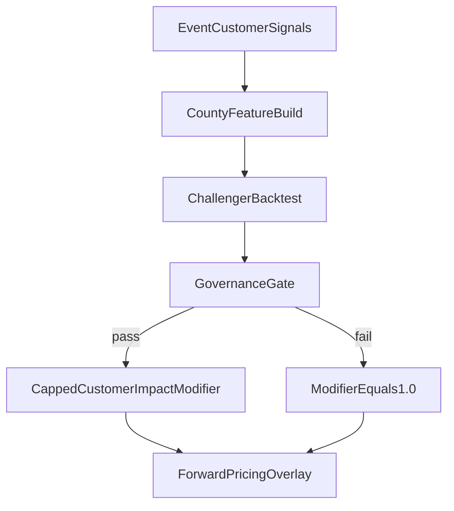

# Outage Baseline Adjustment Framework

Date: 2026-05-21

## Status

Planning note. Do not change `price_engine/` pricing from this file yet.

This document consolidates the adjustment ideas that are currently split across:

- `docs/plan/forward_looking_modeling_plan.md`
- `docs/dicsscssion/location_aware_outage_pricing/`
- `price_engine/plan/04_confidence_load_stub.md`
- `curated_outage_data/plan/03_phase_forward_modeling_support.md`

## Goal

Keep v0 as the clean historical baseline, then define which overlays can adjust
that baseline later.

Current v0:

```text
lambda_historical(fips, T)
  = count(EAGLE-I county events with duration >= T) / source observation years
```

Possible future view:

```text
lambda_adjusted(location, T, horizon)
  = lambda_historical(fips, T)
    * credibility_modifier(fips, T)
    * regime_modifier(fips, T)
    * grid_condition_modifier(location or fips, horizon)
    * hazard_weather_modifier(location or fips, horizon)
    * location_basis_modifier(location, fips)
    * customer_impact_modifier(fips, T)
    * trigger_alignment_modifier(trigger_source, location, T)
```

This is a planning decomposition, not final production math.

## Core Rule

Every modifier starts as one of:

```text
1.0          validated neutral value
not_used     not yet implemented
unavailable  product should not quote until evidence exists
gate_only    eligibility flag, not a numeric multiplier
```

Do not invent numeric discounts or uplifts just because the direction feels
right.

## Adjustment Layers

| Layer | What it asks | First status |
|---|---|---|
| credibility | Do we trust this county's empirical rate? | v0.5 uncertainty load / credibility blend |
| regime | Is the historical average dominated by specific years or event regimes? | lab/notebook analysis first |
| grid condition | Is the serving grid stronger or weaker than county history implies? | curated utility/grid features |
| hazard/weather | Is weather-driven outage risk elevated or changing? | forward model / scenario layer |
| location basis | Is this premise materially different from county average? | separate location-aware design |
| customer impact | Does the county event population reflect meaningful customer outages, or is it dominated by very small (single/few customer) events that inflate `n_per_year` and `S(T)` denominators? | curated severity features, then gate or capped modifier |
| trigger alignment | Does EAGLE-I county event behavior match the payout oracle? | requires overlap validation |
| commercial viability | Does the resulting premium make sense versus alternatives? | product/underwriting filter |

## Modifier Lifecycle

This framework treats every modifier as **scaffolding for current ignorance**,
not as a permanent feature of the pricing engine. As inputs improve, most
modifiers should shrink toward `1.0` or be **absorbed into the baseline rate**
and retired. A small number are structural and stay no matter how good the
data gets.

Every modifier in this framework must declare which category it belongs to.

### Two categories

```text
total_adjustment
  = bias_correction_modifiers     <-- shrink with better data, can be retired
  * forward_regime_modifiers      <-- structural, do NOT shrink with data quality
```

- **Bias-correction modifiers** exist because the *measurement* of the baseline
  is imperfect. Better data on the relevant dimension makes them collapse.
- **Forward-regime modifiers** exist because the *future* may not look like the
  past. Even perfect history does not eliminate them; better data only
  calibrates them more tightly.

### Activation pattern by category (refined 2026-05-30)

The original modifier-lifecycle wrote a single uniform activation rule
(graduate only after external validation). Shipping the per-customer
basis-risk adjustment surfaced that the lifecycle actually needs to
distinguish **three** activation patterns, one per bucket on the
roadmap:

| Bucket | Activation requirement | Why this pattern is right |
|---|---|---|
| **Basis-risk adjustments** | The underlying assumption is documented in the [assumptions registry](../methodology/assumptions.md) with a stated **resolution path**. External validation is **refinement** that tightens the assumption, not a hard gate. | A basis-risk adjustment is a derivation made from data we already have. It reduces a known systematic error in v0. The corrected baseline is, by construction, more accurate than v0 in expectation. Gating it on external validation would keep the larger error in production while waiting on data that may take quarters to arrive. |
| **Trigger alignment** | A **contracted live feed** + **overlap data** so the bridge between the historical pricing source and the live payout oracle can be empirically calibrated. | Trigger alignment is not a derivation; it is a contract-data integration. The price needs to match the payout, and matching requires data only the contracted oracle can provide. There is no assumption to document the way around it — the bridge must be measured. |
| **Forward-regime improvements** | External validation is required **before** the modifier enters pricing math. | Forward-regime modifiers project future conditions (climate, grid health, hazard) that the historical data does not directly evidence. Without external validation, the projection is unbounded — no amount of assumption documentation substitutes for empirical accuracy on the projection itself. |

Concrete examples of how this applies in the current roadmap:

- **`customer_impact`** (basis-risk) shipped on 2026-05-30 under the
  registry-with-resolution-path rule once
  [A011](../methodology/assumptions.md#a011--per-customer-multiplier-rests-on-a-synchronous-outage-approximation)
  was written. **`location_basis`** (basis-risk) will follow the same
  pattern once a documented premise-level assumption exists.
- **`trigger_alignment`** will not ship until a contracted live feed
  exists, regardless of how well its plan is written.
- **`grid_condition`** and **`hazard_weather`** (forward-regime) will
  still require external validation against forecast or held-out
  evidence, because they are projection modifiers, not measurement
  corrections.

### Why the buckets are sequenced in this order

The team works the buckets in the order **basis-risk → trigger
alignment → forward-regime** for a structural reason that is worth
recording explicitly so it survives team turnover:

**Fix the data-input layer before improving the model on top of it.**

A perfect climate or grid model layered on top of a baseline that is
misaligned with the contract — e.g. county-event grain priced as if
it were per-customer — doesn't compensate for that misalignment. It
adds modelled signal to a misaligned starting point and produces a
number that is harder to defend than the unadjusted v0. The
downstream work would not be usable in the right way.

The same logic governs the trigger-alignment bucket sitting between
basis-risk and forward-regime: even with the data-input layer
correctly derived, if the contract pays against a different event
definition than the price is calibrated to, the live payouts and the
priced rate diverge. Trigger alignment closes that loop before we
layer on the forward-regime signals that depend on a coherent
baseline beneath them.

This principle is the reason the roadmap (and the dashboard's
"Current status" widget) groups tracks into these three buckets rather
than presenting them as a flat list.

### Classification of current modifiers

| Modifier | Category | Shrinks when | Retirement / absorption path |
|---|---|---|---|
| `credibility` | bias-correction | More years of data, hierarchical pooling | Folded into hierarchical baseline rate |
| `regime` | bias-correction | Longer history with proper regime weighting | Baked into baseline as regime-weighted rate |
| `customer_impact` | bias-correction | Event construction uses customer / `% MCC` threshold | **Status as of 2026-05-30: `shipped`** — per-customer chain is the dashboard headline price. Graduation terminal state **(b) Activate as numeric multiplier** chosen via documented discussion. Underlying data constraint captured in [A011](../methodology/assumptions.md#a011--per-customer-multiplier-rests-on-a-synchronous-outage-approximation). Phase 4 (PoUS per-`OutageId` validation) queued as refinement. |
| `location_basis` | bias-correction | Feeder, circuit, or premise-level data | Baseline becomes premise-level, not county |
| `trigger_alignment` | bias-correction | Overlap data with payout oracle | Baseline rebuilt directly on oracle events |
| `grid_condition` | forward-regime | (does not shrink with data quality) | Stays as overlay; calibration improves only |
| `hazard_weather` | forward-regime | (does not shrink with data quality) | Stays as overlay; resolution improves only |

> **First candidate dataset for shrinkage:** the
> [PowerOutage.US API analysis](../extra/poweroutage_us/) is the first concrete
> external source being evaluated against these shrinkage criteria. Its
> [modifier mapping](../extra/poweroutage_us/docs/04_modifier_mapping.md) ties
> each API signal to a specific bias-correction modifier, and its
> [first-look findings](../extra/poweroutage_us/docs/06_findings.md) already show
> strong support for the `customer_impact` modifier (≈64% of live outages affect
> ≤1 customer) and the data primitives for `location_basis` and
> `trigger_alignment`.

### Shrinkage trajectory (conceptual)

```text
  modifier
   value
     ^
 1.5 |     . . .                              forward-regime
     |   .       . .                          (grid, hazard/weather)
 1.2 |  *           . . . . . . . .           stays in stack
     | / \
 1.0 |/   *--------*-------*--------          neutral baseline (1.0)
     |     \                                  bias-correction
 0.8 |      *-----*                           (credibility, customer impact,
     |             \                           location basis, regime,
 0.6 |              *--- (absorbed)            trigger alignment)
     |                                         shrinks then retires
     +-------------------------------------> data maturity
          v0     v0.5      v1     v1+
```

- v0: every bias-correction modifier is needed because the inputs are coarse.
- v0.5: features get better, some modifiers collapse to near `1.0` and become
  gate-only.
- v1: better granularity allows several modifiers to be **absorbed into the
  baseline** rather than living as multipliers.
- v1+: only forward-regime modifiers remain in the multiplicative stack.

### Absorption path (how modifiers retire)

```text
v0 (now):
  lambda_historical(fips, T)
    * credibility * customer_impact * location_basis * regime
    * trigger_alignment * grid_condition * hazard_weather

v0.5 (better event construction + curated features):
  lambda_historical(fips, T)
    * credibility * [customer_impact ~ 1.0] * location_basis * regime
    * trigger_alignment * grid_condition * hazard_weather
         ^
         folded into 02_construct_events.py and retired

v1 (premise-level data + oracle overlap):
  lambda_premise(location, T)
    * credibility * [regime baked in]
    * grid_condition * hazard_weather
         ^
         location_basis and trigger_alignment absorbed into the baseline

v1+ (mature):
  lambda_premise(location, T, horizon)
    * grid_condition * hazard_weather
         ^
         only forward-regime modifiers remain
```

### Important second-order effect

Better granularity sometimes **reveals heterogeneity that needs more nuanced
adjustment, not less**. For example, feeder-level data may show that a few
premises in a county need large uplifts while the rest stay flat. The right
response is usually to **shift complexity from modifiers into the baseline
rate**, not to add more modifiers.

```text
coarse data:   one baseline + many modifiers
fine data:     richer baseline + fewer, structural modifiers
```

### Rule for every new modifier

When a new modifier is proposed, the framework requires it to declare:

1. Category: `bias-correction` or `forward-regime`.
2. Shrinkage trigger: which data improvement causes it to shrink.
3. Retirement criterion: what input change retires it entirely.
4. Whether it can be absorbed into the baseline rate, and how.

This keeps the modifier stack **finite and decreasing over time** for
bias-correction effects, while preserving structural modifiers that legitimately
belong as overlays.

## Granularity Loopholes

The most important loophole is:

```text
county outage event != premise outage event
```

County-level history can overstate a resilient downtown premise and understate a
weak feeder, rural edge, or exposed service area.

Granularity issues to document before changing prices:

| Issue | Why it matters |
|---|---|
| county-to-location basis risk | customer may not share county average outage experience |
| utility service territory mismatch | county can contain multiple utilities and grid conditions |
| feeder/circuit heterogeneity | local reliability can differ sharply inside one county |
| outage-source mismatch | EAGLE-I event may not match OMS/sensor/public-map trigger event |
| event-definition mismatch | 30/45/60 minute stitching changes event count and duration |
| data-quality heterogeneity | EAGLE-I coverage, DQI, and reporting gaps vary by region |

## Customer Impact Modifier

> **Detailed plan:** the execution of this modifier — math validation,
> shadow-rate pipeline, dashboard surface, external validation, and
> graduation gate — is tracked in
> [`per_customer_pricing_plan.md`](per_customer_pricing_plan.md). This
> section keeps the modifier definition and lifecycle classification; the
> phased build sits in the plan file.

This is a new candidate modifier added because v0 event construction treats every
positive-customer outage as one event, regardless of how many customers were
affected. That makes `n_per_year` and `S(T)` denominator-sensitive to very small
events (e.g. one customer out for several hours), which can produce premiums
that look unrealistically high to non-technical reviewers even when the math is
internally consistent.

### What it asks

```text
Does the county event population reflect meaningful customer outages,
or is it dominated by single-customer / very small events that look like
qualifying events for pricing but do not match a realistic claim picture?
```

### Why it is a separate modifier and not folded into `location_basis_modifier`

The two factors answer different questions:

| Modifier | Question | Data primitive |
|---|---|---|
| `location_basis_modifier` | Is the specific premise different from the county average? | premise/feeder/utility territory features |
| `customer_impact_modifier` | Is the county event distribution itself a fair claim picture? | event-level `min/max/mean_customers`, `mcc`, derived intensity |

Folding customer impact into `location_basis_modifier` would conflate
within-county heterogeneity (premise vs county) with the county-level event
distribution. Keep them separate so each modifier has one job and an auditable
data source.

If data sparsity makes a standalone modifier unstable, the framework still
allows treating customer impact as a sub-component of `location_basis_modifier`,
documented explicitly with its weighting and governance.

### Candidate inputs

From `price_engine/data/events.parquet` and county aggregates:

- `max_customers`, `mean_customers` per event
- `peak_out_pct_mcc = max_customers / mcc` per event
- county aggregates such as share of events with `max_customers < N`,
  `peak_customers_p95`, planned `customer_minutes_out`

These are already preserved by event construction
(`price_engine/data/02_construct_events.py`) and partly surfaced as evidence in
the dashboard. They are not in pricing math today.

### Lifecycle category

```text
category            = bias-correction
shrinkage_trigger   = event construction uses customer / % MCC threshold,
                      or severity-conditional S(T) features
retirement_path     = folded into price_engine/data/02_construct_events.py
                      so the baseline no longer counts trivial outages as events
```

See [Modifier Lifecycle](#modifier-lifecycle) for how this fits into the broader
retirement principle.

### Status — graduated to numeric multiplier (2026-05-30)

```text
customer_impact_modifier = mean(mean_customers / MCC | duration >= T)   # per (FIPS, T, catalog)
status                   = shipped — headline price                       # bias-correction rule, A011 documents the data constraint
```

History:

1. Pre-2026-05-30 placeholder: `1.0` / `gate_only` — design.
2. Phase 2 (per-customer pricing plan, 2026-05-30): graduated to a
   per-(FIPS, T) numeric value emitted alongside `λ_county`, with the
   three-status coverage gate (`available` / `caution` / `not_available`).
3. Phase 5 (governance, same day): terminal state **(b) Activate as
   numeric multiplier** chosen. Per-customer chain becomes the
   dashboard headline price. The underlying data constraint is
   documented in [A011](../methodology/assumptions.md#a011--per-customer-multiplier-rests-on-a-synchronous-outage-approximation);
   Phase 4 (PoUS per-`OutageId` validation) is queued as refinement
   that tightens A011 when capacity permits.

### Activation rules (do not skip)

A modifier can move from `gate_only` / `1.0` to an active numeric multiplier
only when all of these are satisfied:

1. Feature definition is documented in `curated_outage_data/schemas/` with a
   stable computation and source.
2. County-year backtest exists comparing v0 baseline vs candidate adjustment.
3. Lift/discount is bounded (caps and floors documented in the model card).
4. Monotonicity check: increasing severity intensity should not produce
   unexpected non-monotone premium changes.
5. Stability check: county-level adjustment is stable across catalog choices
   (30/45/60 minute event stitching).
6. Sensitivity bands documented for urban/rural, MCC availability, and
   modelability tier.
7. Rollback path exists and is one config flag away.

If any of these fail, the modifier stays at `1.0` or `gate_only`.

### Rollout path



## What We Should Build First

1. Keep historical v0 unchanged.
2. Build adjustment features in `curated_outage_data/`.
3. Backtest each modifier as a challenger, not as a pricing change.
4. Report each adjustment as lift/discount from v0.
5. Cap or gate modifiers until validation is strong.
6. Only move a modifier into pricing after it has a model card and rollback
   path.

## Resource Backlog For Adjustment Work

These sources are worth saving now. Later, when transcripts/slides/papers are
available, extract the method details into feature ideas, validation rules, and
modeling constraints.

| Resource | Why it is useful for us | How to use later |
|---|---|---|
| WISER North American Forecasting Model webinar | Directly aligned with weather, outage, load, and damage forecasting; useful strategic reference | get transcript/slides, extract architecture, data sources, phases, validation language |
| WISER North American Forecasting Model project page | Mentions CONUS + Quebec scope, proprietary/public data, EAGLE-I, HRRR, CONUS404, outage/damage/load modules | compare with our architecture and curated-data roadmap |
| UConn/Eversource Predicting Outages | Operational OPM reference with high-resolution weather, vegetation, geographic data, up-to-three-day view, six-hour updates | extract operational lead times, data families, location-basis features |
| UConn/Eversource OPM and emergency response page | Discusses many storm simulations, geographic/electrical attributes, restoration and emergency response use | separate outage occurrence, damage, and restoration modeling |
| Dynamic thunderstorm outage prediction paper | Good example of event dynamics and hourly outage modeling instead of only event-total counts | use for regime/time-dynamics design |
| Lead-time weather forecast uncertainty paper | Shows how forecast uncertainty propagates into outage prediction and why 1-3 day vs 4-5 day horizons differ | use for uncertainty bands and forecast-horizon governance |
| ORNL EAGLE-I + NWS outage prediction paper | Directly relevant because it combines EAGLE-I with NWS weather alert datasets | use as state-level public-data baseline reference |
| ORNL RePOWERD restoration paper | Focuses restoration rate and estimated restoration time after severe-weather outages | keep separate from outage occurrence pricing; useful for duration/restoration layer |
| HRRR public archive | Operational 3-km, hourly, radar-assimilating weather model | possible weather forecast/history feature source |
| CONUS404 and CONUS404 PGW | High-resolution historical hydroclimate and future-perturbed weather/climate dataset | possible historical weather baseline and climate-adjustment scenario source |

## Transcript Extraction Template

When we process a webinar or paper, extract:

```text
source title
source type
hazard/peril scope
geography
forecast horizon
target variable
input data families
spatial grain
temporal grain
model family
validation metric
operational decision supported
known limitations
ideas for our adjustment framework
```

The output should not be a generic summary. It should answer:

```text
Which modifier does this improve?
What data would we need?
What failure mode does it address?
What would prove it beats v0?
```

## Similar Sources To Mine First

### WISER / UConn / Eversource

- WISER IUCRC webinar:
  https://wiser-iucrc.com/north-american-forecasting-model-webinar
- WISER project page:
  https://wiser-iucrc.com/north-american-forecasting-model-outage-damage-and-load
- UConn/Eversource Predicting Outages:
  https://www.eversource.uconn.edu/predicting-outages/
- UConn/Eversource OPM and emergency response:
  https://www.eversource.uconn.edu/outage-prediction-modeling-and-emergency-response/
- UConn/Eversource high-resolution weather forecasting:
  https://www.eversource.uconn.edu/high-resolution-weather-forecasting/

### Papers And Research Notes

- Dynamic Modeling of Power Outages Caused by Thunderstorms:
  https://www.mdpi.com/2571-9394/2/2/151
- The Effect of Lead-Time Weather Forecast Uncertainty on Outage Prediction
  Modeling:
  https://www.mdpi.com/2571-9394/3/3/31
- Predicting Power Outage During Extreme Weather with EAGLE-I and NWS Datasets:
  https://www.ornl.gov/publication/predicting-power-outage-during-extreme-weather-eagle-i-and-nws-datasets
- RePOWERD: Restoration of Power Outage from Wide-Area Severe Weather
  Disruptions:
  https://www.ornl.gov/publication/repowerd-restoration-power-outage-wide-area-severe-weather-disruptions

### Weather And Climate Data For Adjustment Features

- NOAA HRRR public archive:
  https://registry.opendata.aws/noaa-hrrr-pds/
- CONUS404 and CONUS404 PGW:
  https://ral.ucar.edu/dataset/conus404-and-conus404-pgw

## Open Questions

- Should the first adjustment target `lambda(T)` only, or also duration
  survival `S(T)`?
- Should weather/hazard adjustment be historical-feature based first, or use
  forecast products such as HRRR immediately?
- Should location-basis adjustment be an eligibility gate until live-trigger
  overlap data exists?
- What is the minimum backtest needed before a modifier can affect pricing?
- How should we cap modifiers so they cannot create unjustified premium jumps?
- Should `customer_impact_modifier` stay standalone, or be merged into
  `location_basis_modifier` once curated severity features stabilize?

## Near-Term Recommendation

Use the WISER webinar and project page as a reference bookmark now.

Next concrete modeling step:

```text
build county-year targets and features
run v0 benchmark backtest
add one challenger at a time:
  credibility -> grid condition -> hazard/weather -> trigger alignment
```

Do not jump directly from the webinar to pricing changes. Use the transcript to
improve the adjustment architecture and feature roadmap first.
